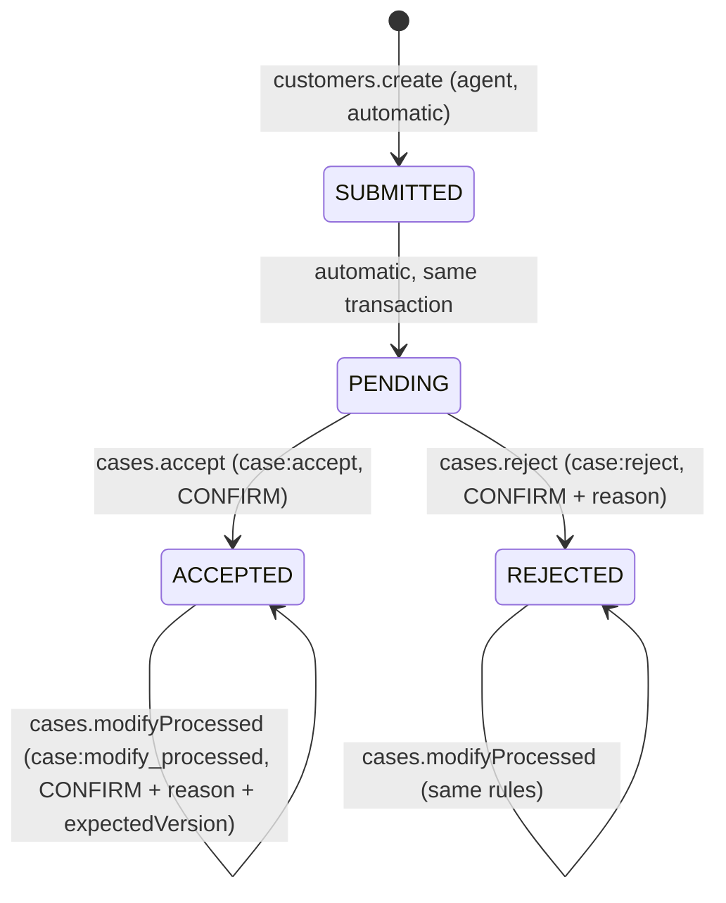

# Case workflow (Account 2)

Source of truth in code: `apps/api/src/workflow/transition-table.ts`. Adding a transition = adding one row there.

## Transition table
| Action | From → To | Permission | Confirm | Reason | Audit |
|---|---|---|---|---|---|
| CREATE | none → SUBMITTED | system | – | – | CASE_CREATED |
| QUEUE | SUBMITTED → PENDING | system | – | – | – |
| ACCEPT | PENDING → ACCEPTED | case:accept | yes | no | CASE_ACCEPTED |
| REJECT | PENDING → REJECTED | case:reject | yes | yes | CASE_REJECTED |
| MODIFY_PROCESSED | ACCEPTED/REJECTED → same | case:modify_processed | yes | yes | CASE_MODIFIED |

Served at `GET /workflow/transitions`.

## Rules
- Team Leader (default permissions) edits customer data (`cases.update`, `customers.update`) and sets call length only while the case is PENDING. Processed cases return `CASE_ALREADY_PROCESSED`; use modify-processed.
- Accept/Reject: one DB transaction, `SELECT ... FOR UPDATE` on the case row, status re-checked after the lock. `accept_reject_actions.caseId` is UNIQUE as a database backstop. Losers get `CASE_ALREADY_PROCESSED`.
- Missing/incorrect `confirm` → `CONFIRMATION_REQUIRED` (checked before validation of other fields).
- Every mutation bumps `case.version`, writes a `case_revisions` row (feeds `cases.history`) and, for status changes, a `workflow_transitions` row.
- Modify-processed keeps status, processedAt and processedBy (the original decision) and records the modifier in history.

## Error mapping
| Situation | Code (HTTP) |
|---|---|
| Accept/reject a processed case | CASE_ALREADY_PROCESSED (409) |
| Action impossible from current status (e.g. modify a PENDING case) | INVALID_STATUS_TRANSITION (409) |
| Stale expectedVersion | VERSION_CONFLICT (409) |
| Duplicate phone in the organization | PHONE_ALREADY_EXISTS (409) |
| Other agent's / other tenant's case | NOT_FOUND (404) |
